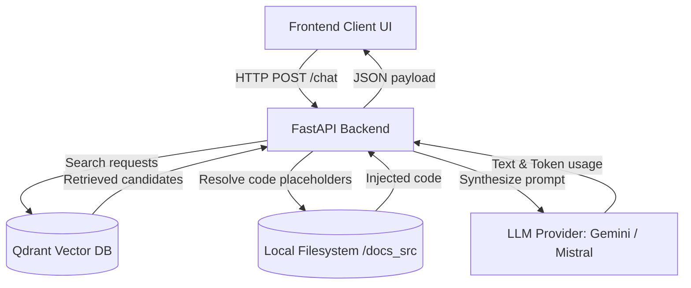
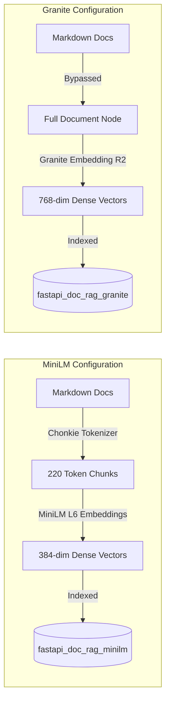

# System Architecture

The FastAPI RAG service organizes components into three primary tiers: the Vector Storage Tier, the API/Business Logic Tier, and the Frontend Visualization Tier.

---

## 1. Pipeline Configuration Tiers

The application supports dynamic switching of embedding, chunking, and storage configurations via the `RAG_MODEL_TIER` settings variable.

### MiniLM Configuration (`minilm`)
*   **Chunking:** Enabled. Documents are chunked into small nodes of at most **220 tokens** using a tokenizer-based splitter (`chonkie`).
*   **Embeddings:** Generates **384-dimensional** dense vectors using `sentence-transformers/all-MiniLM-L6-v2`.
*   **Storage Space:** Writes to and queries from the `fastapi_doc_rag_minilm` Qdrant collection.

### Granite Configuration (`granite`)
*   **Chunking:** Bypassed. Every documentation source file is treated as a single, undivided node.
*   **Embeddings:** Generates **768-dimensional** dense vectors using `ibm-granite/granite-embedding-english-r2`.
*   **Storage Space:** Writes to and queries from the `fastapi_doc_rag_granite` Qdrant collection.

---

## 2. Ingestion Infrastructure
The files within the `ingestion/` directory are executed during the database setup phase:
1.  **Parse Markdown:** Reads raw documentation `.md` files.
2.  **Generate Chunks:** Based on the active model configuration tier, either chunks the documents or keeps them whole.
3.  **Calculate Metadata:** Computes absolute file path mappings, page URLs, headers, and token counts.
4.  **Insert Vectors:** Generates embeddings for chunks and uploads payloads to Qdrant.
