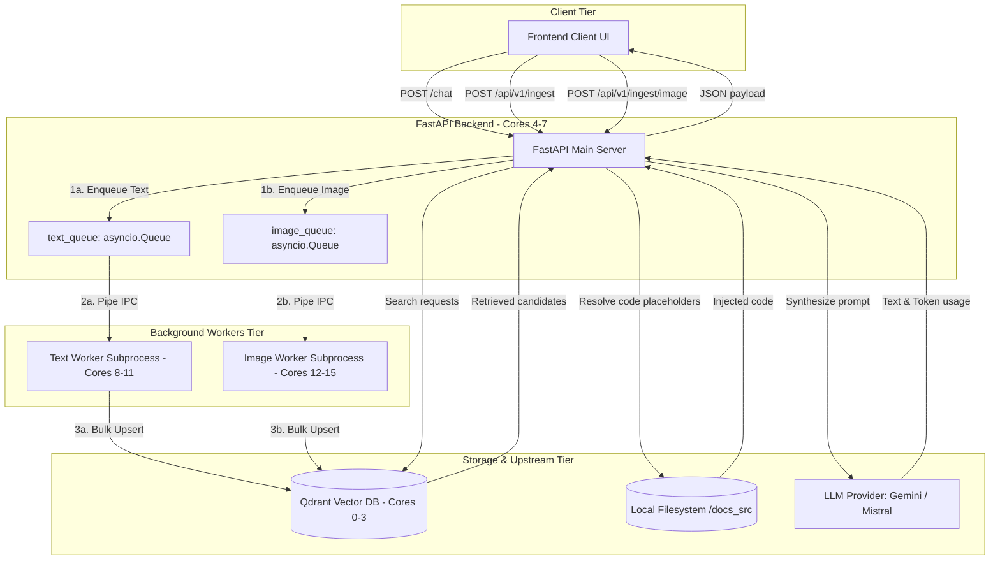
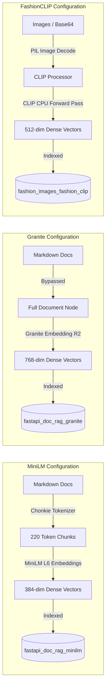

# System Architecture

The FastAPI RAG service organizes components into three primary tiers: the Vector Storage Tier, the API/Business Logic Tier, and the Frontend Visualization Tier.

---

## 1. Pipeline Configuration Tiers

The application supports dynamic switching of embedding, chunking, and storage configurations via the `RAG_MODEL_TIER` settings variable.

### MiniLM Configuration (`minilm`)
*   **Chunking:** Enabled. Documents are chunked into small nodes of at most **220 tokens** using a tokenizer-based splitter (`chonkie`).
*   **Embeddings:** Generates **384-dimensional** dense vectors using `sentence-transformers/all-MiniLM-L6-v2`.
*   **Storage Space:** Writes to and queries from the `fastapi_doc_rag_minilm` Qdrant collection.

### Granite Configuration (`granite`)
*   **Chunking:** Bypassed. Every documentation source file is treated as a single, undivided node.
*   **Embeddings:** Generates **768-dimensional** dense vectors using `ibm-granite/granite-embedding-english-r2`.
*   **Storage Space:** Writes to and queries from the `fastapi_doc_rag_granite` Qdrant collection.

### FashionCLIP Configuration (`fashion_clip`)
*   **Processing:** Subprocess downloads remote URLs concurrently via `ThreadPoolExecutor` or decodes in-memory Base64 strings.
*   **Embeddings:** Generates **512-dimensional** dense vectors using `patrickjohncyh/fashion-clip`.
*   **Storage Space:** Writes to the `fashion_images_fashion_clip` Qdrant collection.

---

## 2. Ingestion Infrastructure
The files within the `ingestion/` directory are executed during the database setup phase or run continuously in the background:
1.  **Parse Markdown / Images:** Reads raw documentation `.md` files or processes incoming API payloads.
2.  **Generate Chunks / Decode Base64:** Chunks text documents (based on model tier) or decodes/normalizes image pixels.
3.  **Calculate Metadata:** Computes file path mappings, section page URLs, product IDs, captions, and token counts.
4.  **Insert Vectors:** Generates embeddings (MiniLM, Granite, or FashionCLIP) and uploads payloads to Qdrant.

