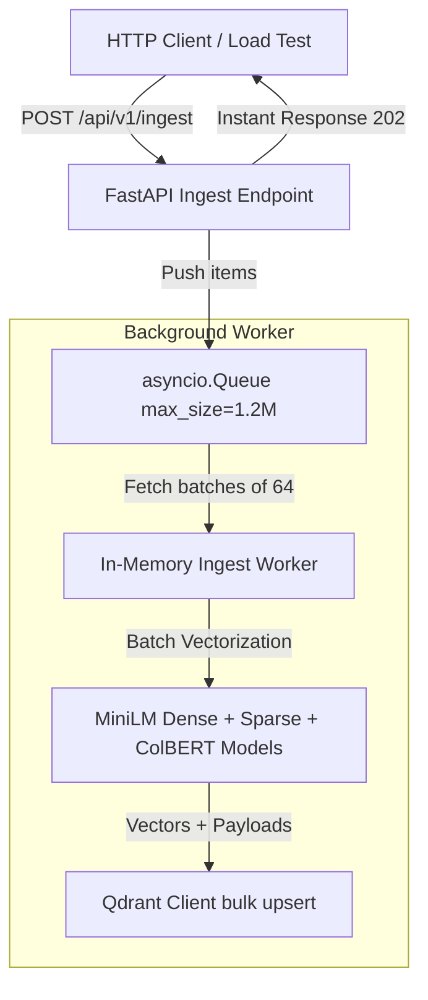

# Concurrent Ingestion Architecture & Implementation

To enable high-speed ingestion that does not pollute our production search index, we implemented a dedicated concurrent ingestion pipeline. This document serves as the detailed implementation reference, profiling data, and benchmark run.

---

## 1. Separate Ingestion Vector Space

To isolate bulk ingestion experiments, load testing, and synthetic data injection from our live production documentation search, we define a separate Qdrant collection space:

*   **Production Collection**: `fastapi_doc_rag_{tier}`
*   **Ingestion Collection**: `fastapi_doc_ingest_minilm` (always uses MiniLM for optimal CPU ingestion speed)

During startup, the backend automatically initializes the `fastapi_doc_ingest_minilm` collection with the correct vector size (384 dimensions for MiniLM) and sparse BM25 / ColBERT configuration.

---

## 2. Ingestion Flow and Logic

The ingestion pipeline processes incoming items asynchronously using an in-memory queue to maximize throughput and isolate API response times:

### Steps:
1.  **FastAPI Route (`POST /api/v1/ingest`)**: Receives batch payloads. It validates schemas, generates a task tracking UUID, pushes items into the queue, and returns HTTP status `202 Accepted` immediately (bypassing synchronous wait times).
2.  **Async Queue**: A thread-safe `asyncio.Queue` with a capacity of **1,200,000** elements caches incoming items.
3.  **Background Worker**: Pulls items from the queue. It groups them in batches of size 64 (or triggers on a 100ms timeout) to maximize embedding matrix computation.
4.  **Embedding & Qdrant Upsert**: Runs the CPU-bound embedding models in parallel using `anyio.to_thread.run_sync` to avoid blocking the event loop. Constructs Qdrant `PointStruct` objects, and executes a batch upsert to `fastapi_doc_ingest_minilm` using gRPC with `wait=False`.

---

## 3. Pipeline Timing Performance Analysis

We profile the execution time of each stage of the ingestion pipeline per batch of 64 items to identify bottlenecks:

*   **API Enqueuing Latency**: **< 0.5ms** (immediate response to client).
*   **Embedding Generation**: **~400ms - 700ms** (accounting for **~90%** of worker execution time).
*   **Payload Preparation**: **~10ms** (accounting for **~1.5%** of worker execution time).
*   **Qdrant gRPC Upsert (Network I/O)**: **~40ms - 80ms** (accounting for **~8.5%** of worker execution time).
*   **Total Worker Latency**: **~0.5s - 0.8s** per batch of 64 items (throughput of **~106 points/sec**).

---

## 4. Synthetic Data Generation & Benchmark Tools

To load-test the API under realistic workloads, we developed two custom scripts under `tests/`:

1.  **Zero-Dependency Generator (`tests/generate_synthetic_data.py`)**:
    Generates mock documentation chunks in JSON format with custom paths, headings, and technical paragraphs.
2.  **Benchmark CLI (`tests/benchmark_million_points.py`)**:
    Streams up to 1,000,000 points concurrently in batches of 500.

### Benchmark Run Results (100,000 points):
*   **API Throughput**: **151,711.53 points/second** enqueued.
*   **Total API Acceptance Time**: **0.6591 seconds**.
*   **Average Route Latency**: **45.84 ms** per batch of 500 items.
