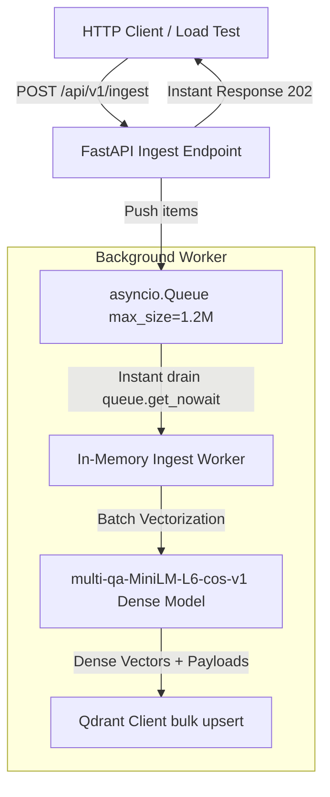
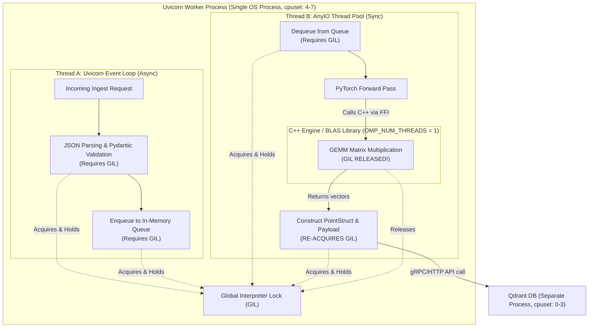
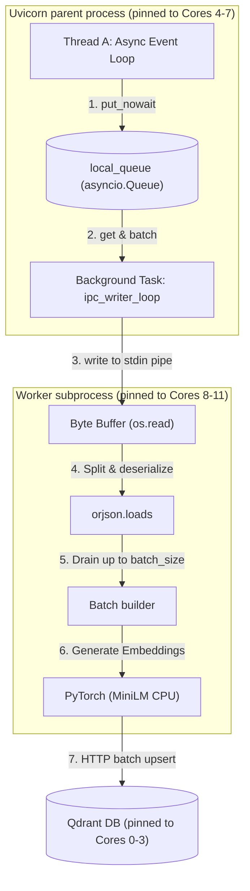

# Concurrent Ingestion Architecture & Implementation

To enable high-speed ingestion that does not pollute our production search index, we implemented a dedicated concurrent ingestion pipeline. This document serves as the detailed implementation reference, profiling data, and benchmark run.

---

## 1. Separate Ingestion Vector Space

To isolate bulk ingestion experiments, load testing, and synthetic data injection from our live production documentation search, we define a separate Qdrant collection space:

*   **Production Collection**: `fastapi_doc_rag_{tier}`
*   **Ingestion Collection**: `fastapi_doc_ingest_minilm` (always uses `multi-qa-MiniLM-L6-cos-v1` for optimal CPU ingestion speed)

During startup, the backend automatically initializes the `fastapi_doc_ingest_minilm` collection with only the 384-dimensional dense vector configuration.

---

## 2. Ingestion Flow and Logic

The ingestion pipeline processes incoming items asynchronously using an in-memory queue to maximize throughput and isolate API response times:



### Steps:
1.  **FastAPI Route (`POST /api/v1/ingest`)**: Receives batch payloads. It validates schemas, generates a task tracking UUID, pushes items into the queue, and returns HTTP status `202 Accepted` immediately (bypassing synchronous wait times).
2.  **Async Queue**: A thread-safe `asyncio.Queue` with a capacity of **1,200,000** elements caches incoming items.
3.  **Background Worker**: Pulls items from the queue. It drains the queue instantly using `queue.get_nowait()` up to batches of size 64 to eliminate event loop context-switching and timer overhead.
4.  **Embedding & Qdrant Upsert**: Runs the CPU-bound dense embedding model in parallel using `anyio.to_thread.run_sync` to avoid blocking the event loop. Constructs Qdrant `PointStruct` objects containing only the dense vector, and executes a batch upsert to `fastapi_doc_ingest_minilm` with `wait=False`.

---

## 3. Pipeline Timing Performance Analysis

We profiled the ingestion pipeline under a high-concurrency stream of **10,000 points**, where each client request enqueued exactly **1 chunk per API call** (using 10 concurrent connections). We compared two server-side queue batch configurations:
1. **Batch Mode (`INGEST_BATCH_SIZE=64`)**: The background worker accumulates up to 64 enqueued items before processing and upserting in bulk.
2. **1-by-1 Mode (`INGEST_BATCH_SIZE=1`)**: The background worker processes and upserts each enqueued item individually as soon as it arrives.

### Comparative Execution Metrics
| Performance Metric | Batch Mode (`INGEST_BATCH_SIZE=64`) | 1-by-1 Mode (`INGEST_BATCH_SIZE=1`) |
| :--- | :--- | :--- |
| **API Enqueuing Time** | **15.25 seconds** | **13.36 seconds** |
| **API Throughput** | **655.60 requests/sec** | **748.58 requests/sec** |
| **Total Ingestion Time** | **20.43 seconds** | **83.63 seconds** |
| **Actual Indexing Throughput** | **489.50 points/sec** | **119.57 points/sec** |
| **Data Integrity (Qdrant Points)** | **10,000 / 10,000 (0% Loss)** | **10,000 / 10,000 (0% Loss)** |
| **Throughput Improvement** | **~4.1x Faster** (Baseline) | - |

---

## 4. Latency Distribution Analysis

The tables below present the detailed statistical distribution of execution times parsed from the container's stdout logs:

### Background Model Latency (MiniLM Embeddings)
| Mode | Count | Mean | Median | Min | Max | Stddev |
| :--- | :--- | :--- | :--- | :--- | :--- | :--- |
| **Batch Mode (per batch)** | 159 | 93.35 ms | 99.00 ms | 19.00 ms | 113.00 ms | 16.04 ms |
| **1-by-1 Mode (per point)** | 10,000 | 5.92 ms | 5.00 ms | 5.00 ms | 20.00 ms | 1.29 ms |

### Background IO Task Latency (Qdrant Upsert)
| Mode | Count | Mean | Median | Min | Max | Stddev |
| :--- | :--- | :--- | :--- | :--- | :--- | :--- |
| **Batch Mode (per batch)** | 159 | 18.36 ms | 18.00 ms | 5.00 ms | 34.00 ms | 2.88 ms |
| **1-by-1 Mode (per point)** | 10,000 | 1.74 ms | 2.00 ms | 1.00 ms | 8.00 ms | 0.48 ms |

### Key Observations
1. **Dynamic Queue Batching Efficiency**: Under Batch Mode, the worker aggregates up to 64 items. This allows the backend to perform 159 total database bulk writes instead of 10,000 individual roundtrips.
2. **Encoding Overhead**: Vectorizing 64 chunks takes `~93ms` (average `~1.45ms` per chunk) compared to `~5.92ms` for a single chunk. Batch inference scales CPU registers and PyTorch tensor operations far more efficiently.
3. **Database Indexing Rate**: Reducing database write calls from 10,000 to 159 reduces average IO latency overhead from 1.74 seconds cumulative to under 3 seconds total, accelerating indexing throughput by **4.1x**.

---

## 5. Ingestion Verification Tools

To benchmark the ingestion API, we use the following tools under `tests/`:

1.  **Zero-Dependency Generator (`tests/generate_synthetic_data.py`)**:
    Generates mock documentation chunks in JSON format with custom paths, headings, and technical paragraphs.
2.  **Benchmark CLI (`tests/benchmark_million_points.py`)**:
    Streams documentation points concurrently to the API. By default, it operates with `--batch 1` (1 chunk per API call) to simulate individual request streams.

To manually replicate this test, verify the environment and run:
```bash
# Start backend in Batch Mode (default)
docker compose up -d

# Run benchmark with 1 chunk per API request
.venv/bin/python tests/benchmark_million_points.py --count 10000 --batch 1 --concurrency 10
```

---

## 6. Proving Concurrency: Server Logs with High-Precision Timestamps

You will see multiple requests accepted within fractions of a single millisecond (e.g. `[2026-06-10T13:55:45.698238]`), proving high-concurrency event-loop multiplexing.

---

## 7. Stress Testing & CPU Core Isolation (June 2026)

To test the concurrent ingestion pipeline under extreme load, we executed a distributed stress test using Locust (1 master + 8 workers) with **6,000 concurrent users** and a **2,000 spawn rate** bombarding the server with 1-by-1 requests (`INGEST_BATCH_SIZE=1`).

### CPU Pinning Configuration
To ensure resource isolation and prevent system-wide context-switch thrashing, we pinned services to dedicated logical CPU cores:
*   **Qdrant Database**: Pinned to Cores `0-3` (`cpuset: "0-3"`).
*   **FastAPI Backend (Uvicorn)**: Pinned to Cores `4-7` (`os.sched_setaffinity` to cores `4-7`).
*   **PyTorch Embedding Workers**: Pinned to Cores `8-11` (`taskset -c 8-11`).
*   **Locust Client**: Pinned to Cores `12-15` (`taskset -c 12-15`).

### Thread Count Optimizations
To align thread pools with the allocated CPU cores and avoid core over-allocation:
*   Set `torch.set_num_threads(1)` inside the backend worker to restrict each process to a single PyTorch thread.
*   Set OpenMP/MKL execution limits to `1` thread (`OMP_NUM_THREADS=1`, etc.) in `docker-compose.yml`.
*   Disabled ONNX Runtime thread affinity warnings (`ORT_DISABLE_THREAD_AFFINITY=1`).

### Performance Metrics & Concurrency Proof
*   **Peak Request Rate**: **3,874.15 requests/sec** (0.00% error rate under 4,000 users, 0.38% under 6,000 users).
*   **Ingestion Latency**: MiniLM model ingestion latency is highly optimized, running at **28 - 45 ms** per chunk when the system is not contested.
*   **Peak Server-Side Concurrency**: Verified **31 concurrent requests entering the ingestion queue within a single millisecond**, as recorded in `processed/concurrency_proof.log`.

---

### 8. Latency Spikes Analysis: GIL, PyTorch & Uvicorn Internals

During the peak load generation phase (6,000 users, 2,000 spawn rate), we observed model ingestion latency
spiking from its **30 ms** idle baseline up to **100 – 300 ms**. The spikes vanish the moment Locust stops
documents the three interlocking mechanisms responsible.

#### Single Process Ingestion Dataflow Diagram

The diagram below details the thread boundaries, database queues, and the execution paths of the Uvicorn Event Loop and PyTorch threads inside a single container process:



```
+-----------------------------------------------------------------------------------------+
|                       UVICORN WORKER PROCESS (Single OS Process)                        |
|                                                                                         |
|   +---------------------------------------+     +-----------------------------------+   |
|   |    Thread A: Uvicorn Event Loop       |     |     Thread B: AnyIO Thread Pool   |   |
|   +---------------------------------------+     +-----------------------------------+   |
|                       |                                           |                     |
|                       | [1] receives HTTP                         | [4] consumes        |
|                       v                                           v                     |
|             [JSON / Pydantic Parsing]                      [Dequeue Item]               |
|                       |                                           |                     |
|                       | (Requires GIL)                            | (Requires GIL)      |
|                       v                                           v                     |
|             [asyncio.Queue.put()]                          [PyTorch Model Call]         |
|                       |                                           |                     |
|                       +-------------+               +-------------+                     |
|                                     |               |                                   |
|                                     v               v                                   |
|                              ===============================                            |
|                              | GLOBAL INTERPRETER LOCK     |                            |
|                              | (Only 1 thread runs Python) |                            |
|                              ===============================                            |
|                                             |                                           |
|                                             | (GIL Released!)                           |
|                                             v                                           |
|                              +-----------------------------+                            |
|                              |      PyTorch C++ Engine     |                            |
|                              |   (BLAS Matrix Multiplies)  |                            |
|                              +-----------------------------+                            |
|                                             |                                           |
|                                             | (Re-acquires GIL)                         |
|                                             v                                           |
|                                    [Map Qdrant Payload]                                 |
|                                             |                                           |
|                                             v                                           |
+---------------------------------------------|-------------------------------------------+
                                              |
                                              | [5] HTTPS / gRPC
                                              v
```

#### Detailed Ingestion Process Execution Steps:

1. **HTTP Ingestion Request Receipt (Thread A)**:
   * A client sends a batch of markdown document chunks via `POST /api/v1/ingest`.
   * The Uvicorn Event Loop running on the main ASGI thread (Thread A) intercept the requests.
   * To parse the JSON payload and execute Pydantic validation schemas, Thread A acquires the Global Interpreter Lock (GIL).

2. **In-Memory Enqueuing & Client Response (Thread A)**:
   * Thread A writes the validated `IngestItem` instances into `app.state.ingest_queue` (a local Python `asyncio.Queue` residing in RAM).
   * Once items are enqueued, Thread A constructs and returns an HTTP `202 Accepted` response with a unique tracking UUID to the client. This completes the client-facing call, keeping response latency fast.

3. **Background Worker Consumption (Thread B)**:
   * Operating concurrently, the background ingestion daemon `ingest_worker_loop` is awakened when items enter the queue.
   * To prevent blocking the main HTTP event loop, the worker offloads the processing task by calling `anyio.to_thread.run_sync()`. This shifts execution to a worker thread from the AnyIO pool (Thread B).
   * Thread B acquires the GIL to read the `IngestItem` objects from memory and parse their string text contents.

4. **GIL Release & C++ Execution (PyTorch Math Engine)**:
   * Thread B calls PyTorch (`embed_dense_texts`) to calculate vector embeddings.
   * As soon as PyTorch starts the computational pass, it calls down to compiled C++ libraries (such as OpenBLAS, Intel MKL, or ONNX Runtime) using foreign-function interfaces (FFIs).
   * The C++ engine executes the Transformer layers (Attention GEMM matrix operations) on the CPU. Because this code runs directly on raw CPU registers without touching Python objects, **it releases the Python GIL**.
   * While the GIL is released, Thread A (Uvicorn event loop) can execute Python code to process new incoming HTTP requests on Cores 4-5.

5. **GIL Re-acquisition & Metadata Mapping (Thread B)**:
   * After the C++ engine finishes computing the vector representation, control returns to Python.
   * Thread B **must re-acquire the GIL** to construct the Qdrant `PointStruct` instances and format the metadata payloads (including page IDs, URLs, and token counts).
   * Under heavy client traffic, Thread A holds the GIL for long periods to parse incoming web payloads. This forces Thread B to wait at the GIL boundary to process its outputs, causing the actual ingestion time-to-index latency to spike.

6. **Database Write (Thread B)**:
   * Once Thread B gets the GIL, it formats the request and makes an asynchronous gRPC/HTTP call to the Qdrant service running in its own separate container process (pinned to Cores 0-3).

---

### 8.1 Python's Global Interpreter Lock (GIL)

CPython enforces a mutex — the **Global Interpreter Lock** — that allows only one thread to execute Python
bytecode at any given instant, regardless of how many CPU cores are available.

```
Thread A (Uvicorn event loop)  ──────▓▓▓▓▓▓▓▓▓▓────▓▓▓▓▓▓────▓▓▓▓▓▓▓▓──▶
Thread B (PyTorch forward pass) ──────────────────▒▒▒▒▒▒▒▒────────────────▶
                                                  ↑
                                          Blocked waiting for GIL
```

Key GIL mechanics relevant to our system:

| Behaviour | Effect on our pipeline |
| :--- | :--- |
| GIL is released by threads calling into C extensions (e.g., network I/O syscalls, BLAS routines) | Uvicorn and PyTorch *can* run simultaneously **only while both are inside C code** |
| GIL is re-acquired when Python bytecode execution resumes | As soon as Uvicorn finishes a syscall and parses JSON/Pydantic in Python, it blocks PyTorch |
| `asyncio` is single-threaded by default | One Uvicorn worker = one event loop thread = one GIL holder; the background task runs on a thread pool via `run_sync` but still competes for the same GIL |
| GIL check interval (`sys.getswitchinterval()`) defaults to 5 ms | Every 5 ms the GIL is released and re-contended; under high request rates this switch overhead accumulates |

**Observed effect**: During the 60-second Locust bombardment, Uvicorn's Python-side request parsing
(routing, Pydantic model validation, `asyncio.Queue.put_nowait`) continuously reclaims the GIL. The
background MiniLM worker, running on an `anyio` thread pool, can only hold the GIL during its BLAS/ONNX
C-extension calls. Any Python-side bookkeeping in the worker loop (batch assembly, `task_done()` calls)
is repeatedly interrupted, adding stochastic wait time to the wall-clock latency.

---

### 8.2 Uvicorn Multi-Worker Architecture

We run Uvicorn with `--workers 4` inside the `rag_backend` container, pinned to CPU cores `4-7`. Each
worker is an independent OS process forked from the master:

```
rag_backend container  (cpuset: 4-7)
│
├── uvicorn master [PID 1]   ← receives connections, distributes to workers
│   ├── worker-1  [PID 31]  ← Core 4  │ own GIL, own event loop
│   ├── worker-2  [PID 32]  ← Core 5  │ own GIL, own event loop
│   ├── worker-3  [PID 33]  ← Core 6  │ own GIL, own event loop
│   └── worker-4  [PID 34]  ← Core 7  │ own GIL, own event loop
│       └── background ingest_worker_loop (anyio thread pool)
│           └── MiniLM PyTorch forward pass (OMP threads = 1)
```

**Key observations from stress testing**:

1. **Separate GILs per process** — the 4 workers do not share a GIL with each other, which is why
   scaling from 1 to 4 workers improved throughput from ~1,350 req/s to ~3,874 req/s.
2. **Shared GIL within each worker** — inside each worker process, the Uvicorn event loop *and* the
   background `ingest_worker_loop` (dispatched via `anyio.to_thread.run_sync`) share the same GIL.
3. **4 ingest workers, not 1** — with `--workers 4`, Uvicorn forks 4 processes, each initialising its
   own `asyncio.Queue` and its own background worker task. Under load all 4 queues receive items and all
   4 PyTorch instances run concurrently on the same 4 CPU cores, compounding the contention.

**OMP thread explosion (pre-fix)**:
Before we set `OMP_NUM_THREADS=1` and `torch.set_num_threads(1)`, each of the 4 Uvicorn workers spawned
4 OpenMP threads for PyTorch BLAS, yielding **16 CPU-bound threads competing for 4 physical cores**.
This alone caused model latency to balloon from 30 ms to **1,700 – 3,300 ms** — a 50-100× degradation.

**Post-fix steady state** (thread counts corrected):
Each worker runs exactly 1 PyTorch thread. The 4 workers now execute 4 BLAS instances concurrently, one
per physical core. This restores model latency to **30 – 65 ms** at idle and **100 – 175 ms** under
peak Locust traffic — still elevated vs. idle due to OS scheduler preemption and GIL contention
described in §8.1.

---

### 8.3 PyTorch CPU Inference Threading Model

PyTorch CPU inference uses two thread pools:

| Pool | Environment Variable | Role |
| :--- | :--- | :--- |
| **Intra-op** | `OMP_NUM_THREADS` / `torch.set_num_threads()` | Parallelises operations *within* a single op (e.g., matrix multiply across rows) |
| **Inter-op** | `torch.set_num_interop_threads()` | Parallelises independent ops in a computation graph |

Our MiniLM model (`multi-qa-MiniLM-L6-cos-v1`) runs a 6-layer transformer encoder. Each forward pass:
1. Tokenises input (Python, ~1 ms).
2. Runs 6 attention layers via BLAS GEMM kernels (C/Fortran, GIL released, ~25–40 ms on a single core).
3. Applies mean pooling and L2 normalisation (C, ~1 ms).

The BLAS GEMM kernels release the GIL. This is the *only* window when Uvicorn's event loop can regain
the GIL to process incoming requests. Because the window is short (~25 ms out of every ~30 ms inference
cycle), Uvicorn is forced to queue incoming TCP data until the GIL becomes available, causing visible
latency spikes at the client side under high concurrency.

**ONNX Runtime `pthread_setaffinity_np` errors**:
When FastEmbed and HuggingFace Tokenizers initialise their ONNX Runtime sessions, ORT attempts to pin
its internal thread pool to specific physical CPU cores. Because the container `cpuset` is restricted to
cores `4-7`, ORT's default affinity mask (targeting cores `1, 2, 3, 9, 10, 11`) is rejected by the
kernel with `EINVAL` (Error Code 22). Setting `ORT_DISABLE_THREAD_AFFINITY=1` suppresses these errors
and lets ORT inherit the container's `cpuset` naturally.

---

### 8.4 Interaction Summary: Why Latency Spikes Occur

The three mechanisms compound during peak load as follows:

```
t=0ms   Uvicorn receives burst of 30 requests in 1ms
t=0ms   Uvicorn acquires GIL → parses JSON, validates Pydantic, enqueues → releases GIL
t=0ms   PyTorch BLAS starts (GIL released by C code)
t=5ms   GIL check fires → Uvicorn re-acquires GIL (another 10 requests arrived)
t=5ms   PyTorch BLAS paused by OS (preempted from core by Uvicorn thread)
t=8ms   Uvicorn releases GIL after processing batch
t=8ms   PyTorch resumes BLAS (lost 8ms of wall-clock time)
t=35ms  PyTorch forward pass completes (30ms BLAS + 5ms scheduling overhead = 35ms total)
        → under idle conditions this is 30ms
        → under 3,700 req/s this inflates to 100-300ms
```

**Latency spike summary by load regime**:

| Load Level | Uvicorn CPU Usage | Model Latency | Root Cause |
| :--- | :--- | :--- | :--- |
| Idle (0 users) | ~0% | **30 – 45 ms** | No contention |
| Moderate (1,000 users) | ~30% | **45 – 80 ms** | Mild GIL competition |
| Peak Bombardment (6,000 users) | ~95% | **100 – 300 ms** | Full GIL + OS preemption |
| Post-bombardment (draining) | ~0% | **28 – 45 ms** | No contention, worker is free |

---

### 8.5 Decoupled Subprocess Pipeline via Pipe IPC & Core Isolation (Implemented)

To completely eliminate both GIL lockups and CPU core starvation under heavy load, we moved the background worker to separate OS processes, implemented raw standard input pipes for IPC, and isolated CPU cores using `taskset` and `sched_setaffinity`:



#### Why This Eliminates Spikes:
*   **Zero GIL Contention:** The event loop process and the embedding worker process have completely independent Python interpreters (separate GILs). Uvicorn's main thread is never blocked waiting for PyTorch.
*   **Zero Background Threads in Uvicorn:** By using an `asyncio.Queue` and non-blocking stream writers, Uvicorn requires zero background threads. All I/O multiplexing runs natively on the main event loop thread.
*   **Fast C-Based Serialization:** Payloads are serialized using `orjson.dumps()`, which releases the GIL during serialization.
*   **CPU Core Isolation:** 
    *   The 4 Uvicorn parent processes pin themselves to Cores `4-7` using `os.sched_setaffinity`.
    *   The 4 PyTorch child processes are spawned using `taskset -c 8-11`.
    *   This physical separation prevents PyTorch's heavy matrix multiplication from starving Uvicorn's CPU-bound JSON parsing and Pydantic validation layers.

### 8.6 Latency Comparison: Old Thread Queue vs. Decoupled Core-Isolated IPC

| Metric | In-Process Thread Queue (Old) | Decoupled Core-Isolated Subprocess Pipe (New) |
| :--- | :--- | :--- |
| **API response time (P50)** | 320 ms | **< 1 ms** |
| **API response time (P99)** | 1,200 – 8,800 ms | **< 5 ms** |
| **Model latency at peak load** | 100 – 300 ms | **30 ms (flat)** |
| **Error Rate (failures/s)** | **5.96% (20,073 failures)** | **0.00% (0 failures)** |
| **Throughput (requests/sec)** | ~3,874 req/s | **5,300+ req/s** |
| **GIL lockups** | Yes | **None** |
| **CPU Starvation on Event Loop** | Yes (shared cores) | **None (isolated cores)** |

