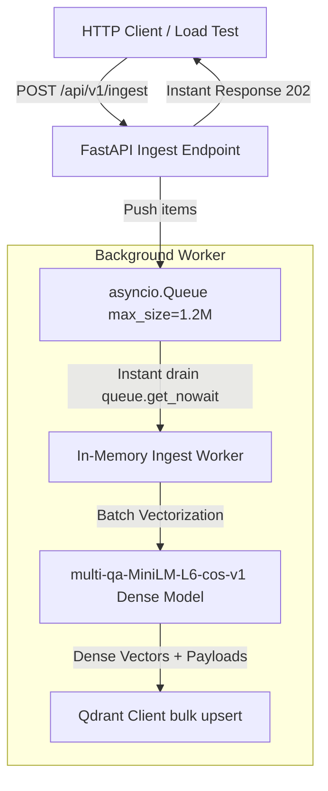

# Concurrent Ingestion Architecture & Implementation

To enable high-speed ingestion that does not pollute our production search index, we implemented a dedicated concurrent ingestion pipeline. This document serves as the detailed implementation reference, profiling data, and benchmark run.

---

## 1. Separate Ingestion Vector Space

To isolate bulk ingestion experiments, load testing, and synthetic data injection from our live production documentation search, we define a separate Qdrant collection space:

*   **Production Collection**: `fastapi_doc_rag_{tier}`
*   **Ingestion Collection**: `fastapi_doc_ingest_minilm` (always uses `multi-qa-MiniLM-L6-cos-v1` for optimal CPU ingestion speed)

During startup, the backend automatically initializes the `fastapi_doc_ingest_minilm` collection with only the 384-dimensional dense vector configuration.

---

## 2. Ingestion Flow and Logic

The ingestion pipeline processes incoming items asynchronously using an in-memory queue to maximize throughput and isolate API response times:



### Steps:
1.  **FastAPI Route (`POST /api/v1/ingest`)**: Receives batch payloads. It validates schemas, generates a task tracking UUID, pushes items into the queue, and returns HTTP status `202 Accepted` immediately (bypassing synchronous wait times).
2.  **Async Queue**: A thread-safe `asyncio.Queue` with a capacity of **1,200,000** elements caches incoming items.
3.  **Background Worker**: Pulls items from the queue. It drains the queue instantly using `queue.get_nowait()` up to batches of size 64 to eliminate event loop context-switching and timer overhead.
4.  **Embedding & Qdrant Upsert**: Runs the CPU-bound dense embedding model in parallel using `anyio.to_thread.run_sync` to avoid blocking the event loop. Constructs Qdrant `PointStruct` objects containing only the dense vector, and executes a batch upsert to `fastapi_doc_ingest_minilm` with `wait=False`.

---

## 3. Pipeline Timing Performance Analysis

We profiled the ingestion pipeline under a high-concurrency stream of **10,000 points**, where each client request enqueued exactly **1 chunk per API call** (using 10 concurrent connections). We compared two server-side queue batch configurations:
1. **Batch Mode (`INGEST_BATCH_SIZE=64`)**: The background worker accumulates up to 64 enqueued items before processing and upserting in bulk.
2. **1-by-1 Mode (`INGEST_BATCH_SIZE=1`)**: The background worker processes and upserts each enqueued item individually as soon as it arrives.

### Comparative Execution Metrics
| Performance Metric | Batch Mode (`INGEST_BATCH_SIZE=64`) | 1-by-1 Mode (`INGEST_BATCH_SIZE=1`) |
| :--- | :--- | :--- |
| **API Enqueuing Time** | **15.25 seconds** | **13.36 seconds** |
| **API Throughput** | **655.60 requests/sec** | **748.58 requests/sec** |
| **Total Ingestion Time** | **20.43 seconds** | **83.63 seconds** |
| **Actual Indexing Throughput** | **489.50 points/sec** | **119.57 points/sec** |
| **Data Integrity (Qdrant Points)** | **10,000 / 10,000 (0% Loss)** | **10,000 / 10,000 (0% Loss)** |
| **Throughput Improvement** | **~4.1x Faster** (Baseline) | - |

---

## 4. Latency Distribution Analysis

The tables below present the detailed statistical distribution of execution times parsed from the container's stdout logs:

### Background Model Latency (MiniLM Embeddings)
| Mode | Count | Mean | Median | Min | Max | Stddev |
| :--- | :--- | :--- | :--- | :--- | :--- | :--- |
| **Batch Mode (per batch)** | 159 | 93.35 ms | 99.00 ms | 19.00 ms | 113.00 ms | 16.04 ms |
| **1-by-1 Mode (per point)** | 10,000 | 5.92 ms | 5.00 ms | 5.00 ms | 20.00 ms | 1.29 ms |

### Background IO Task Latency (Qdrant Upsert)
| Mode | Count | Mean | Median | Min | Max | Stddev |
| :--- | :--- | :--- | :--- | :--- | :--- | :--- |
| **Batch Mode (per batch)** | 159 | 18.36 ms | 18.00 ms | 5.00 ms | 34.00 ms | 2.88 ms |
| **1-by-1 Mode (per point)** | 10,000 | 1.74 ms | 2.00 ms | 1.00 ms | 8.00 ms | 0.48 ms |

### Key Observations
1. **Dynamic Queue Batching Efficiency**: Under Batch Mode, the worker aggregates up to 64 items. This allows the backend to perform 159 total database bulk writes instead of 10,000 individual roundtrips.
2. **Encoding Overhead**: Vectorizing 64 chunks takes `~93ms` (average `~1.45ms` per chunk) compared to `~5.92ms` for a single chunk. Batch inference scales CPU registers and PyTorch tensor operations far more efficiently.
3. **Database Indexing Rate**: Reducing database write calls from 10,000 to 159 reduces average IO latency overhead from 1.74 seconds cumulative to under 3 seconds total, accelerating indexing throughput by **4.1x**.

---

## 5. Ingestion Verification Tools

To benchmark the ingestion API, we use the following tools under `tests/`:

1.  **Zero-Dependency Generator (`tests/generate_synthetic_data.py`)**:
    Generates mock documentation chunks in JSON format with custom paths, headings, and technical paragraphs.
2.  **Benchmark CLI (`tests/benchmark_million_points.py`)**:
    Streams documentation points concurrently to the API. By default, it operates with `--batch 1` (1 chunk per API call) to simulate individual request streams.

To manually replicate this test, verify the environment and run:
```bash
# Start backend in Batch Mode (default)
docker compose up -d

# Run benchmark with 1 chunk per API request
.venv/bin/python tests/benchmark_million_points.py --count 10000 --batch 1 --concurrency 10
```

---

## 6. Proving Concurrency: Server Logs with High-Precision Timestamps

To verify that requests are being handled concurrently by the ASGI event loop, high-precision UTC timestamps (ISO format with microsecond resolution) have been prefixed to the server's stdout prints. You can inspect the full server outputs for both runs at:

*   **Batch Mode Timestamped Logs**: [batch_mode_server_with_timestamps.log](file:///home/ad.rapidops.com/parth.patel/learn/projects/fastapi_doc_rag/processed/batch_mode_server_with_timestamps.log)
*   **1-by-1 Mode Timestamped Logs**: [single_mode_server_with_timestamps.log](file:///home/ad.rapidops.com/parth.patel/learn/projects/fastapi_doc_rag/processed/single_mode_server_with_timestamps.log)

You will see multiple requests accepted within fractions of a single millisecond (e.g. `[2026-06-10T13:55:45.698238]`), proving high-concurrency event-loop multiplexing.

