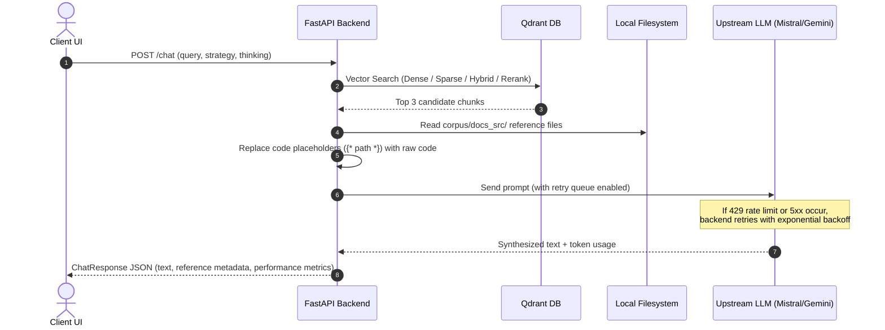
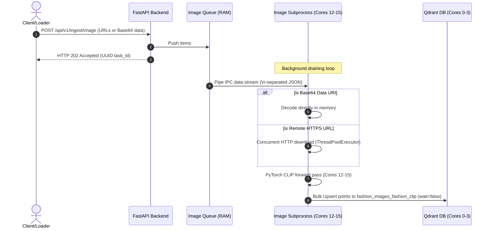

# RAG Pipeline Dataflow

This section describes the dynamic end-to-end execution flow of a query through the retrieval and synthesis modules.

---

## 1. Vector Retrieval Strategies

The user can select from four retrieval strategies on the frontend:

### A. Dense Search
Queries the dense vector index in Qdrant using Cosine Similarity. The query is converted into embeddings (MiniLM or Granite) and matched against stored node embeddings.

### B. Sparse Search
Executes keyword matching inside Qdrant's sparse index using the BM25 model, ideal for finding exact class, function, or keyword names.

### C. Hybrid Search
Performs both Dense Search and Sparse Search concurrently, merging candidates using **Reciprocal Rank Fusion (RRF)** to combine semantic and keyword-match relevance.

### D. Hybrid + Rerank
Runs Hybrid Search to retrieve candidate chunks, then feeds the top candidates through a local **ColBERT late-interaction cross-encoder model** (`colbert-ir/colbertv2.0`) to rerank the results based on deep token-level query interactions. The top 3 reranked results are returned.

---

## 2. Context Reconstruction & Code Injection

Standard vector chunks often refer to source code files (e.g., `{* tutorial/cors/src/main.py *}`). If fed directly to the LLM, the model would lack the actual code context.

Our backend addresses this via a **Dynamic Code Injection** handler:
1.  **Parse Placeholders:** Identifies files referenced within `{* ... *}` tags in the retrieved chunks.
2.  **Filesystem Lookup:** Resolves the path relative to the `corpus/docs_src/` root directory.
3.  **File Reading:** Reads the raw python code from disk.
4.  **Token Optimization:** Replaces the placeholder with the actual code contents, collapses duplicate newlines (`\n{3,}` $\rightarrow$ `\n\n`) to preserve token boundaries, and compiles the final structured prompt context.

---

## 3. Resilient Upstream Communication

To handle rate limits and transient gateway errors from free-tier providers (such as Mistral or Gemini), the backend implements a resilient HTTP client wrapper:
*   **Monitored Status Codes:** Retries on `429 Too Many Requests` and standard `500`-`504` server errors.
*   **Header Inspection:** Dynamically waits for the length specified in the standard `Retry-After` header if sent by the provider.
*   **Backoff & Jitter:** If the header is absent, waits using exponential backoff with random jitter (`base_delay * 2^attempt + random(0, 0.5)` seconds) for up to 5 attempts before raising a gateway timeout.

---

## 4. Multimodal Image Ingestion Dataflow

When processing visual payloads via `POST /api/v1/ingest/image`, the API enqueues items instantly to return a `202 Accepted` status. A background worker subprocess (pinned to cores 12-15) asynchronously downloads or decodes the image, runs the FashionCLIP CPU forward pass, and indexes the points.

1.  **Enqueuing Payload:** The backend receives requests at `/api/v1/ingest/image` containing either raw HTTP URLs or inline Base64 data URIs. Payload schemas are validated, and the objects are pushed into the memory queue.
2.  **Immediate Acknowledgment:** The client receives a fast 202 Accepted response with a UUID `task_id` (average HTTP response latency < 5ms).
3.  **IPC Serialization:** A background task (`run_ipc_writer_loop`) drains the queue, converts items to JSON strings separated by `\n` using `orjson`, and writes the raw bytes to the stdin pipe of the `ingest_image_worker` subprocess.
4.  **Local Memory Decoding / Concurrent Downloads:** The worker subprocess reads from stdin. Remote HTTP images are fetched in parallel threads using `ThreadPoolExecutor` to handle download IO latency. Base64 strings are decoded directly in memory to bypass network overhead entirely.
5.  **Multimodal Vectorization:** Decoded PIL Images are normalized and processed into tensors. A forward pass via FashionCLIP (`get_image_features`) running on cores 12-15 generates 512-dimensional dense embeddings.
6.  **Qdrant Database Upsert:** The computed vectors and product/caption metadata are mapped to Qdrant `PointStruct` instances and upserted in batches to the `fashion_images_fashion_clip` collection.

