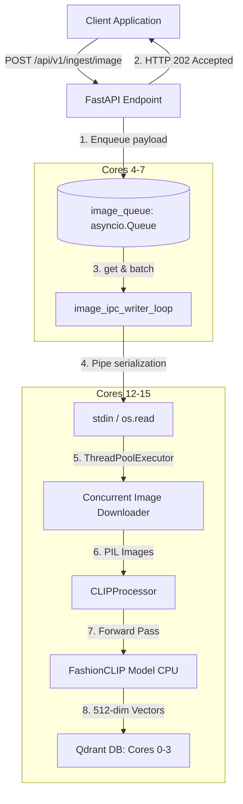

# FashionCLIP Image Ingestion Pipeline

To expand the capabilities of the FastAPI RAG service to support visual search, we introduce a multimodal image ingestion pipeline. This pipeline leverages **FashionCLIP** (`patrickjohncyh/fashion-clip`) to process image URLs, generate 512-dimensional dense visual embeddings, and index them in Qdrant.

To maintain our performance SLA under high-concurrency ingestion workloads, this feature mirrors our decoupled multiprocessing architecture.

---

## 1. System Architecture

The image ingestion pipeline runs as a separate OS process, fully isolated from both the text ingestion pipeline and Uvicorn's main HTTP server.



---

## 2. API Design & Data Schema

The mirrored endpoint `POST /api/v1/ingest/image` accepts a batch of image items, enqueues them, and returns immediately:

### Request Payloads:
```json
{
  "items": [
    {
      "image_url": "https://example.com/images/shirt_123.jpg",
      "product_id": "prod_123",
      "caption": "Blue cotton crewneck t-shirt",
      "metadata": {
        "category": "apparel",
        "brand": "FashionBrand"
      }
    }
  ]
}
```

### Response Payload:
```json
{
  "status": "accepted",
  "task_id": "f5127814-c104-4df2-811c-22345091a182",
  "queued_count": 1
}
```

---

## 3. Worker Subprocess Pipeline Flow

Inside the isolated child process `ingestion/ingest_image_worker.py`:
1.  **Byte Stream Reader**: Reads serialized payloads from standard input using raw `os.read(0, 65536)` and splits them by newlines (`\n`) to avoid buffering delays.
2.  **Concurrent Image Fetcher**: Downloads images concurrently using a python `ThreadPoolExecutor` to handle network I/O overhead.
3.  **Preprocessing & Tokenization**: Feeds PIL Images to `CLIPProcessor` to resize, normalize, and pre-process images into tensors.
4.  **FashionCLIP Inference**: Executes the PyTorch forward pass `CLIPModel.get_image_features` in a single batched CPU matrix operation to generate normalized embeddings.
5.  **Qdrant Bulk Indexing**: Executes a batch upsert to the `fashion_images` collection in Qdrant.

---

## 4. Hardware Resource Allocation

To prevent resource starvation and CPU scheduling contention, we allocate distinct hardware core pins:

*   **Qdrant Database**: Cores `0-3` (4 Cores)
*   **FastAPI / Uvicorn parent processes**: Cores `4-7` (4 Cores)
*   **Text Ingestion Worker subprocess**: Cores `8-11` (4 Cores)
*   **Image Ingestion Worker subprocess**: Cores `12-15` (4 Cores)
