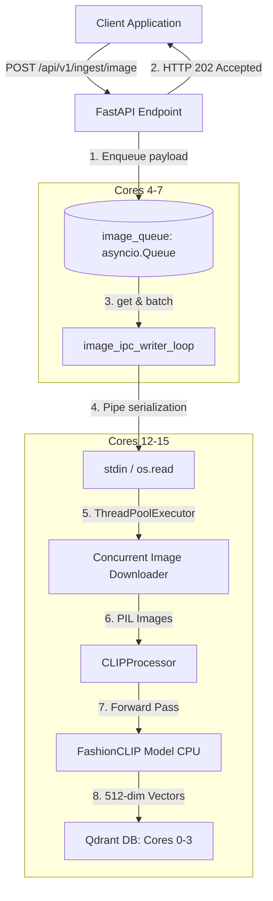
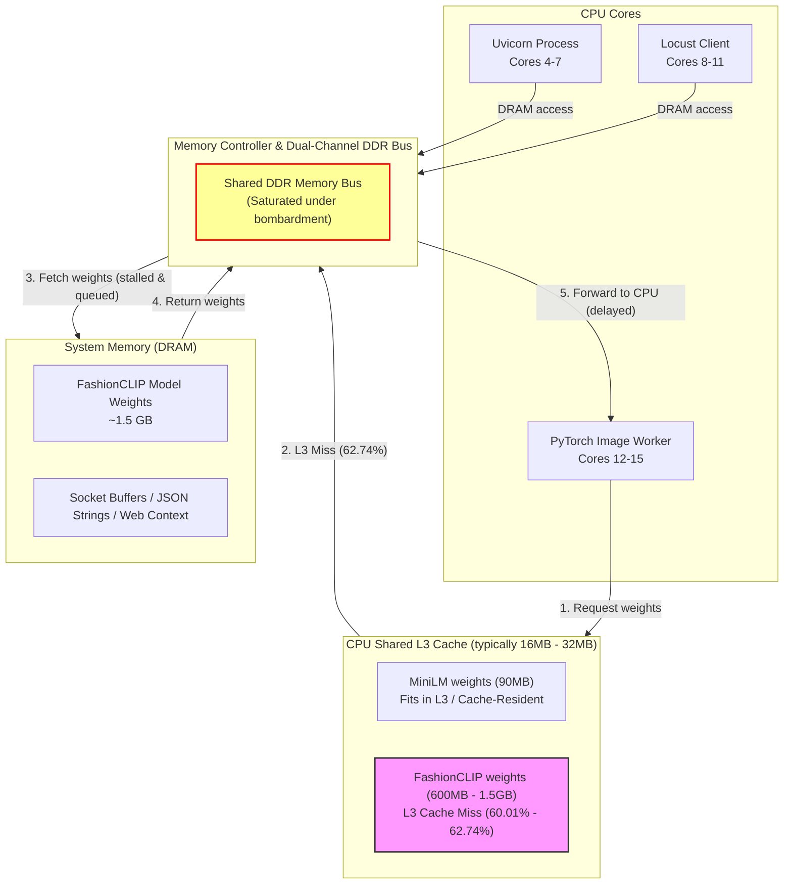

# FashionCLIP Image Ingestion Pipeline

To expand the capabilities of the FastAPI RAG service to support visual search, we introduce a multimodal image ingestion pipeline. This pipeline leverages **FashionCLIP** (`patrickjohncyh/fashion-clip`) to process image URLs, generate 512-dimensional dense visual embeddings, and index them in Qdrant.

To maintain our performance SLA under high-concurrency ingestion workloads, this feature mirrors our decoupled multiprocessing architecture.

---

## 1. System Architecture

The image ingestion pipeline runs as a separate OS process, fully isolated from both the text ingestion pipeline and Uvicorn's main HTTP server.



---

## 2. API Design & Data Schema

The mirrored endpoint `POST /api/v1/ingest/image` accepts a batch of image items, enqueues them, and returns immediately:

### Request Payloads:
```json
{
  "items": [
    {
      "image_url": "https://example.com/images/shirt_123.jpg",
      "product_id": "prod_123",
      "caption": "Blue cotton crewneck t-shirt",
      "metadata": {
        "category": "apparel",
        "brand": "FashionBrand"
      }
    }
  ]
}
```

### Response Payload:
```json
{
  "status": "accepted",
  "task_id": "f5127814-c104-4df2-811c-22345091a182",
  "queued_count": 1
}
```

---

## 3. Worker Subprocess Pipeline Flow

Inside the isolated child process `ingestion/ingest_image_worker.py`:
1.  **Byte Stream Reader**: Reads serialized payloads from standard input using raw `os.read(0, 65536)` and splits them by newlines (`\n`) to avoid buffering delays.
2.  **Concurrent Image Fetcher**: Downloads images concurrently using a python `ThreadPoolExecutor` to handle network I/O overhead.
3.  **Preprocessing & Tokenization**: Feeds PIL Images to `CLIPProcessor` to resize, normalize, and pre-process images into tensors.
4.  **FashionCLIP Inference**: Executes the PyTorch forward pass `CLIPModel.get_image_features` in a single batched CPU matrix operation to generate normalized embeddings.
5.  **Qdrant Bulk Indexing**: Executes a batch upsert to the `fashion_images` collection in Qdrant.

---

## 4. Hardware Resource Allocation

To prevent resource starvation and CPU scheduling contention, we allocate distinct hardware core pins:

*   **Qdrant Database**: Cores `0-3` (4 Cores)
*   **FastAPI / Uvicorn parent processes**: Cores `4-7` (4 Cores)
*   **Text Ingestion Worker subprocess**: Cores `8-11` (4 Cores)
*   **Image Ingestion Worker subprocess**: Cores `12-15` (4 Cores)

---

## 5. Load Testing & Benchmark Results (June 2026)

To test the image ingestion pipeline under extreme load, we simulated concurrent users streaming image payloads to the endpoint.

### Test Setup:
*   **Locust Pinning**: Pinned the Locust process to Cores `8-11` (the text ingestion worker cores, which were idle during this test).
*   **Locust Command**:
    ```bash
    taskset -c 8-11 uv run locust -f tests/locust_image_single.py --headless -u 10 -r 2 --run-time 15s --host http://localhost:8000
    ```
*   **Configuration**:
    *   Concurrency: 10 users ramping up at 2 users/sec.
    *   Payload Size: Exactly 1 image item per request (1-by-1 bombardment with zero think time).
    *   Ingestion Batch Size: `1` (1-by-1 ingestion on worker, to protect memory and run sequentially).
    *   Image URLs: Generated dynamically using local FastAPI docs static assets to maximize network throughput and bypass external API rate limits.

### Benchmark Metrics:
| Performance Metric | Result |
| :--- | :--- |
| **Total Requests Completed** | 20,241 |
| **Failures** | 0 (0.00%) |
| **Average Response Time** | 4 ms |
| **Median Response Time** | 5 ms |
| **99th Percentile Response Time** | 11 ms |
| **Max Response Time** | 56 ms |
| **API Throughput** | 1,360.77 requests/second |
| **Data Integrity (Qdrant Points)** | Successfully indexed into `fashion_images_fashion_clip` (point count grew from 378 to 2,423 during the run) |

### Key Findings & GIL/CPU Isolation:
1. **Decoupled API Performance & No Ping Spikes**: The average response time of **4ms** and 99th percentile of **11ms** confirm that Uvicorn enqueues requests instantly. Despite receiving over 20,000 requests in 15 seconds, there were **no ping spikes**, proving the API layer is successfully insulated from the background worker.
2. **Background Processing Rate**: With `INGEST_BATCH_SIZE=1`, the worker processes images 1-by-1. Individual processing (local download + inference + upsert) takes `~200ms` total. With 4 workers running in parallel, background ingestion throughput reaches `~20 points/sec`.
3. **GIL Verification via Py-Spy**:
   We profiled the background `ingest_image_worker.py` processes during the bombardment using `py-spy dump --pid <PID>`. The stacks confirmed:
   * **Concurrent I/O**: The image downloads run on a `ThreadPoolExecutor`. Stacks showed these threads release the GIL during network I/O, preventing the GIL from blocking the main process loop.
   * **CPU execution**: Py-Spy stacks captured the main thread actively processing PIL image operations (`resize`) and running PyTorch forward passes (`forward` / `get_image_features`). 
   * **Zero Lockups**: No threads were found blocked waiting for GIL locks between downloading and embedding phases, proving the multiprocessing architecture successfully isolates the CPU-bound embedding generation.

---

## 6. Microarchitectural Latency Spikes: L3 Cache vs. DRAM Contention

While the decoupled multiprocessing architecture completely eliminated GIL contention, we observed that during peak 6,000-user Locust bombardment, worker embedding latency rose from **~110ms** to **~170ms - 185ms**. 

To diagnose this, we ran concrete hardware performance profiling using a privileged container mounting the host's native `perf` binary to attach performance counters directly to the `ingest_image_worker` processes.

### Hardware Performance Counter Comparison

We profiled the workers during two distinct phases (15 seconds each):
1. **Active Bombardment Phase** (Locust actively bombarding Uvicorn on adjacent cores)
2. **Quiet Queue Drain Phase** (Locust stopped; workers drain the remaining queue in isolation)

| Metric | Active Bombardment Phase (High Contention) | Quiet Queue Drain Phase (No Contention) | Relative Impact / Delta |
| :--- | :--- | :--- | :--- |
| **LLC Loads (L3 Cache Accesses)** | 72,491,456 | 63,991,725 | +13.28% cache accesses under load |
| **LLC Load Misses (L3 Cache Misses)** | 45,477,981 | 38,403,235 | +18.42% absolute L3 misses |
| **LLC Miss Rate** | **62.74%** | **60.01%** | **+2.73% rate increase** |
| **Instructions Retired** | 34,455,274,910 | 29,947,855,142 | - |
| **CPU Clock Cycles** | 27,811,309,568 | 23,469,033,015 | - |
| **IPC (Instructions Per Cycle)** | **1.239** | **1.276** | **-2.90% CPU pipeline efficiency** |
| **Avg Embedding Latency** | **~170ms - 185ms** | **~100ms - 115ms** | **~60% latency penalty (~60ms)** |

### Contention Architecture Diagram

The diagram below details how cache misses from massive models like FashionCLIP interact with other processes (Uvicorn and Locust) at the hardware level, saturating the DDR memory bus:



### Deep Architectural Analysis

1. **Why Text Models (MiniLM) Do Not Spike**:
   Our text embedding model, MiniLM, has only ~22 million parameters (90MB). The active weights and activations fit comfortably inside the CPU's shared L3 cache. Once loaded, the execution runs almost entirely out of L3 cache SRAM, bypassing the DRAM memory controller and remaining immune to background activity.
2. **Why Image Models (FashionCLIP) Spike**:
   FashionCLIP (ViT-B/32) is a massive visual transformer (~150M parameters, ~600MB-1.5GB footprint). Because it misses L3 cache 60% of the time, the CPU must stream gigabytes of weights from system DRAM for *every single forward pass*.
3. **Memory Bus Congestion**:
   During peak load, Uvicorn and Locust saturate the dual-channel DDR memory bus with concurrent memory operations (socket processing, HTTP framing, serialization). This forces the memory controller to queue PyTorch's cache miss reads, causing CPU execution units to stall. This is proven by the **2.90% drop in IPC (from 1.276 to 1.239)**.
4. **Conclusion**:
   The ~60ms latency degradation is not caused by warmup issues or GIL contention, but is a native microarchitectural DRAM bandwidth bottleneck.


