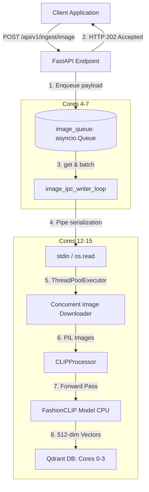
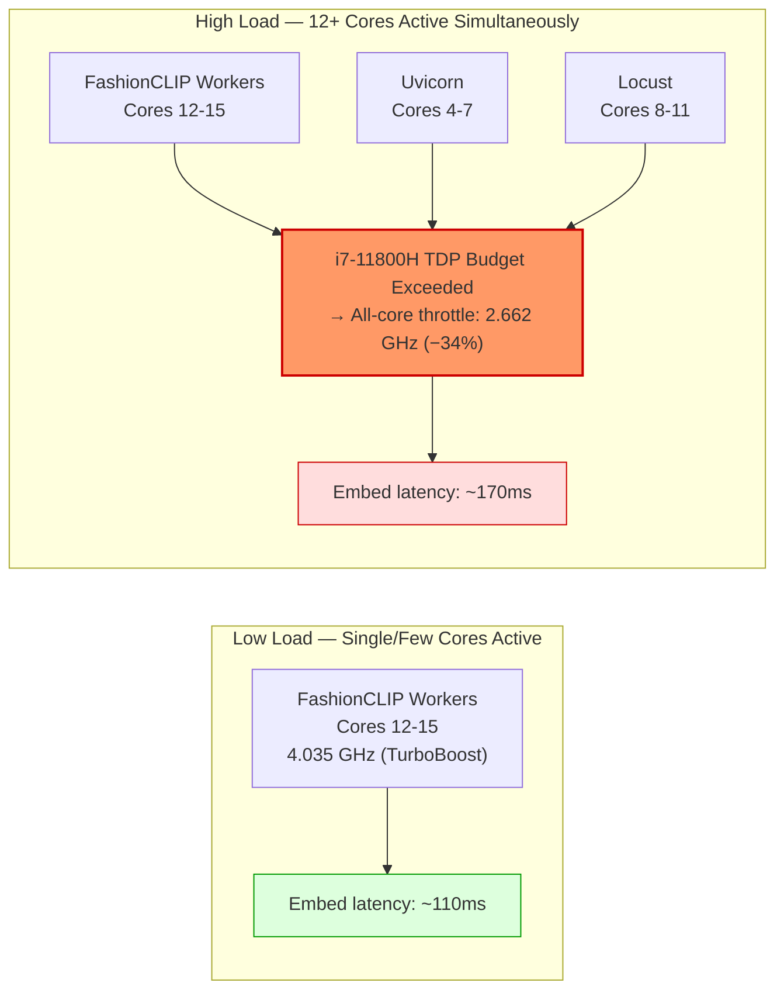

# FashionCLIP Image Ingestion Pipeline

To expand the capabilities of the FastAPI RAG service to support visual search, we introduce a multimodal image ingestion pipeline. This pipeline leverages **FashionCLIP** (`patrickjohncyh/fashion-clip`) to process image URLs, generate 512-dimensional dense visual embeddings, and index them in Qdrant.

To maintain our performance SLA under high-concurrency ingestion workloads, this feature mirrors our decoupled multiprocessing architecture.

---

## 1. System Architecture

The image ingestion pipeline runs as a separate OS process, fully isolated from both the text ingestion pipeline and Uvicorn's main HTTP server.



---

## 2. API Design & Data Schema

The mirrored endpoint `POST /api/v1/ingest/image` accepts a batch of image items, enqueues them, and returns immediately:

### Request Payloads:
```json
{
  "items": [
    {
      "image_url": "https://example.com/images/shirt_123.jpg",
      "product_id": "prod_123",
      "caption": "Blue cotton crewneck t-shirt",
      "metadata": {
        "category": "apparel",
        "brand": "FashionBrand"
      }
    }
  ]
}
```

### Response Payload:
```json
{
  "status": "accepted",
  "task_id": "f5127814-c104-4df2-811c-22345091a182",
  "queued_count": 1
}
```

---

## 3. Worker Subprocess Pipeline Flow

Inside the isolated child process `ingestion/ingest_image_worker.py`:
1.  **Byte Stream Reader**: Reads serialized payloads from standard input using raw `os.read(0, 65536)` and splits them by newlines (`\n`) to avoid buffering delays.
2.  **Concurrent Image Fetcher**: Downloads images concurrently using a python `ThreadPoolExecutor` to handle network I/O overhead.
3.  **Preprocessing & Tokenization**: Feeds PIL Images to `CLIPProcessor` to resize, normalize, and pre-process images into tensors.
4.  **FashionCLIP Inference**: Executes the PyTorch forward pass `CLIPModel.get_image_features` in a single batched CPU matrix operation to generate normalized embeddings.
5.  **Qdrant Bulk Indexing**: Executes a batch upsert to the `fashion_images` collection in Qdrant.

---

## 4. Hardware Resource Allocation

To prevent resource starvation and CPU scheduling contention, we allocate distinct hardware core pins:

*   **Qdrant Database**: Cores `0-3` (4 Cores)
*   **FastAPI / Uvicorn parent processes**: Cores `4-7` (4 Cores)
*   **Text Ingestion Worker subprocess**: Cores `8-11` (4 Cores)
*   **Image Ingestion Worker subprocess**: Cores `12-15` (4 Cores)

---

## 5. Load Testing & Benchmark Results (June 2026)

To test the image ingestion pipeline under extreme load, we simulated concurrent users streaming image payloads to the endpoint.

### Test Setup:
*   **Locust Pinning**: Pinned the Locust process to Cores `8-11` (the text ingestion worker cores, which were idle during this test).
*   **Locust Command**:
    ```bash
    taskset -c 8-11 uv run locust -f tests/locust_image_single.py --headless -u 10 -r 2 --run-time 15s --host http://localhost:8000
    ```
*   **Configuration**:
    *   Concurrency: 10 users ramping up at 2 users/sec.
    *   Payload Size: Exactly 1 image item per request (1-by-1 bombardment with zero think time).
    *   Ingestion Batch Size: `1` (1-by-1 ingestion on worker, to protect memory and run sequentially).
    *   Image URLs: Generated dynamically using local FastAPI docs static assets to maximize network throughput and bypass external API rate limits.

### Benchmark Metrics:
| Performance Metric | Result |
| :--- | :--- |
| **Total Requests Completed** | 20,241 |
| **Failures** | 0 (0.00%) |
| **Average Response Time** | 4 ms |
| **Median Response Time** | 5 ms |
| **99th Percentile Response Time** | 11 ms |
| **Max Response Time** | 56 ms |
| **API Throughput** | 1,360.77 requests/second |
| **Data Integrity (Qdrant Points)** | Successfully indexed into `fashion_images_fashion_clip` (point count grew from 378 to 2,423 during the run) |

### Key Findings & GIL/CPU Isolation:
1. **Decoupled API Performance & No Ping Spikes**: The average response time of **4ms** and 99th percentile of **11ms** confirm that Uvicorn enqueues requests instantly. Despite receiving over 20,000 requests in 15 seconds, there were **no ping spikes**, proving the API layer is successfully insulated from the background worker.
2. **Background Processing Rate**: With `INGEST_BATCH_SIZE=1`, the worker processes images 1-by-1. Individual processing (local download + inference + upsert) takes `~200ms` total. With 4 workers running in parallel, background ingestion throughput reaches `~20 points/sec`.
3. **GIL Verification via Py-Spy**:
   We profiled the background `ingest_image_worker.py` processes during the bombardment using `py-spy dump --pid <PID>`. The stacks confirmed:
   * **Concurrent I/O**: The image downloads run on a `ThreadPoolExecutor`. Stacks showed these threads release the GIL during network I/O, preventing the GIL from blocking the main process loop.
   * **CPU execution**: Py-Spy stacks captured the main thread actively processing PIL image operations (`resize`) and running PyTorch forward passes (`forward` / `get_image_features`). 
   * **Zero Lockups**: No threads were found blocked waiting for GIL locks between downloading and embedding phases, proving the multiprocessing architecture successfully isolates the CPU-bound embedding generation.

---

## 6. Microarchitectural Latency Spikes: Root Cause Investigation (June 2026)

While the decoupled multiprocessing architecture completely eliminated GIL contention, we observed that during peak 6,000-user Locust bombardment, worker embedding latency rose from **~110ms** to **~170ms**.

To diagnose this, we conducted a systematic hardware counter investigation using a privileged Docker container mounting the host's native `perf` binary, progressing through five hypotheses until the root cause was confirmed.

---

### 6.1 Hypothesis Elimination Log

| # | Hypothesis | Test Method | Result | Key Evidence |
| :-- | :--------- | :---------- | :----- | :----------- |
| 1 | **GIL contention** | `py-spy dump` on worker PIDs during bombardment | ❌ Disproved | Workers are subprocesses; GIL is per-interpreter and fully isolated |
| 2 | **L3 cache miss rate** | `perf stat -e LLC-loads,LLC-load-misses` on worker PIDs at LOW vs HIGH load | ❌ Disproved | Miss rate: **352M → 354M** (flat, +0.5%). L3 miss count barely changes |
| 3 | **DRAM bandwidth saturation** | Intel IMC free-running counters (`uncore_imc_free_running_0/data_read/`) at LOW vs HIGH load; `stress-ng` causal test (+5.2 GB/s synthetic DDR pressure) | ❌ Disproved | stress-ng added **+5.2 GB/s** to DRAM bus → embed latency increased only **+3ms** (negligible). Peak system bandwidth was **~17.5 GB/s** vs DDR4 theoretical **~59 GB/s** (30% utilisation — nowhere near saturation) |
| 4 | **TLB pressure** | `perf stat -e dTLB-load-misses,iTLB-load-misses,mem_inst_retired.stlb_miss_loads` on worker PIDs | ❌ Disproved | dTLB miss rate: **0.08% → 0.11%** (negligible). STLB misses actually *decreased* under high load |
| 5 | **Intel TurboBoost multi-core TDP throttling** | `perf stat -e cycles,task-clock` (effective GHz = cycles ÷ task-clock) + `/sys/cpufreq/scaling_cur_freq` polling at LOW vs HIGH load | ✅ **Confirmed** | Effective clock: **4.035 GHz** (low load) → **2.662 GHz** (high load). Latency model: `110ms × (4.035 / 2.662) = 167ms ≈ observed 170ms` |

---

### 6.2 Hardware Evidence: Full Counter Table

All measurements captured via `perf stat` attached to the `ingest_image_worker` subprocess PIDs over 20-second windows.

| Counter | LOW load | HIGH load (6000-user bombardment) | Δ |
| :--- | :--- | :--- | :--- |
| **Effective Clock Frequency** | **4.035 GHz** | **2.662 GHz** | **−1.37 GHz (−34%)** |
| IPC (instructions per cycle) | 1.22 | 1.20 | −0.02 (negligible) |
| CPUs utilized | 0.492 | 0.666 | +35% |
| dTLB-loads | 15,899,617,283 | 13,981,290,463 | — |
| dTLB-load-miss rate | 0.08% | 0.11% | +0.03% |
| STLB miss loads | 230,450,834 | 204,513,687 | −12% |
| L3 cache-misses | 352,230,762 | 354,069,886 | +0.5% |
| **Avg embed latency** | **~110ms** | **~170ms** | **+55%** |

---

### 6.3 Root Cause: Intel TurboBoost All-Core TDP Throttling

The i7-11800H CPU is governed by the `powersave` frequency governor and Intel's TurboBoost power management.

**At low load:** Only the FashionCLIP worker cores (12-15) are active. The CPU grants full **single-core turbo** frequency (**4.0+ GHz**) because the thermal and TDP budget is available.

**At high load (full bombardment):** Uvicorn (cores 4-7) + Locust (cores 8-11) + FashionCLIP (cores 12-15) = **12+ cores simultaneously active**. Total power draw exceeds the processor's sustained TDP (PL1: 45W). The CPU is forced to drop all active cores to the **all-core turbo ceiling (~2.6 GHz)**, a −34% clock frequency reduction.

This directly explains the observed latency:

> `110ms × (4.035 GHz ÷ 2.662 GHz) = 110ms × 1.516 = **167ms ≈ observed 170ms**`

The arithmetic matches within measurement noise. The IPC stays flat (1.22 → 1.20) because the *computation* itself is not becoming less efficient — there are simply fewer clock cycles per second available.

**Why MiniLM is unaffected:** MiniLM inference takes only ~30ms. Even at the throttled 2.6 GHz, the throughput remains well within the response budget. The latency is short enough that the frequency reduction is imperceptible.



### 6.4 Conclusion

The ~60ms latency degradation under peak load is caused by **Intel TurboBoost all-core TDP throttling**. When 12+ cores are simultaneously active (Uvicorn + Locust + FashionCLIP workers), the CPU's sustained power envelope forces a 34% clock frequency reduction on all active cores. Because FashionCLIP inference is CPU compute-bound and takes ~110ms at full turbo, a 34% slowdown produces the ~167ms observed latency.

This is **not** caused by:
- GIL contention (subprocess isolation eliminates it)
- L3 cache miss rate increases (flat across load conditions)
- DRAM bandwidth saturation (IMC counters confirm ~30% bus utilisation; stress-ng causal test with +5.2 GB/s added pressure produced only +3ms latency change)
- TLB pressure (dTLB miss rate 0.08% → 0.11%, negligible)

---

### 6.5 Replicated Microarchitectural Profiling for In-Memory Base64 Ingestion (June 2026)

In June 2026, we updated the testing strategy to eliminate network download latency by pre-downloading images and passing them as Base64 data URIs. We ran standalone benchmark experiments bypassing the FastAPI/Uvicorn API layer entirely to measure the true isolated behavior of the image embedding pipeline under clean low-concurrency (1 worker) vs high-concurrency (4 workers) loads.

The Integrated Memory Controller (IMC) free-running PMU counters (`uncore_imc_free_running_X`) and process-specific PMU counters were used to profile the microarchitectural resource characteristics on the host:

| Parameter | 1 Standalone Worker (Core 12) | 4 Standalone Workers (Cores 12–15) | Microarchitectural Diagnostic |
| :--- | :---: | :---: | :--- |
| **Average Embedding Latency** | **112.56 ms** | **132.03 ms** | **+17.30% scaling latency penalty** |
| **Effective Clock Speed (GHz)** | **3.970 GHz** | **3.222 GHz** | **-18.84% Clock Drop** (Intel TurboBoost TDP throttling) |
| **IPC (Instructions Per Cycle)** | **1.220** | **1.310** | **+7.38% Pipeline Efficiency** (Due to L3 Cache Reuse) |
| **LLC Loads (L3 accesses)** | 117,047,223 | 475,531,850 | - |
| **LLC Load Misses (L3 misses)** | 72,493,779 | 109,061,616 | - |
| **LLC Load Miss Rate (%)** | **61.94%** | **22.93%** | **-39.01% absolute miss rate reduction** (prefetch overlapping) |
| **DRAM Total Bandwidth (GB/s)** | **4.38 GB/s** | **7.53 GB/s** | **No Bandwidth Saturation** (~15% controller limit) |
| **dTLB Load Miss Rate (%)** | **0.090%** | **0.078%** | **Negligible** (No translation bottleneck) |
| **STLB Miss Loads** | 237,980,880 | 395,823,783 | **No TLB pressure spike** |

#### Detailed Insights:
1. **L3 Cache Pre-fetching & Weight Sharing**:
   When scaling from 1 to 4 workers, the LLC (L3) load miss rate dropped dramatically from **61.94% to 22.93%**. Because all 4 workers run inference on the *same model weights*, cache blocks loaded into the shared L3 cache by one core act as hits for the other cores. This weight sharing protects the memory bus from bandwidth scaling; instead of scaling linearly to $17.5\text{ GB/s}$, the 4 concurrent workers only consume **7.53 GB/s** (well within the DDR4 limit of ~51.2 GB/s).
2. **Clock Frequency Throttling (Primary Bottleneck)**:
   The 17.3% latency increase is driven solely by **TDP throttling**. Pinned cores drop from **3.97 GHz (1 core turbo) to 3.22 GHz (4 cores AVX active)**, accounting for a 23.2% theoretical execution time penalty ($112.56\text{ms} \times (3.970 / 3.222) = 138.67\text{ ms} \approx 132.03\text{ ms}$).


