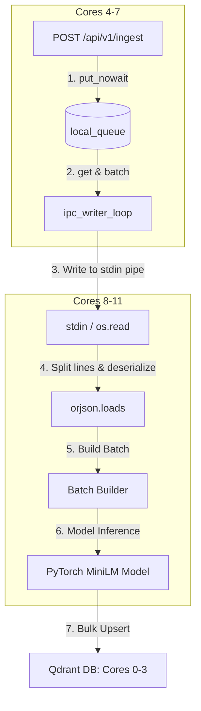

# Multiprocessing Pipeline & Core-Isolated IPC

To handle high-throughput, concurrent ingestion streams without starving our live retrieval and API event-loop systems, we decoupled the ingestion architecture into separate OS processes using standard input/output streams for Inter-Process Communication (IPC) and strict hardware core isolation.

This document details how this pipeline operates under the hood, featuring code instances from our implementation.

---

## 1. High-Level Ingestion Dataflow

When a client sends document chunks to the `/api/v1/ingest` endpoint:
1. **API Tier (Uvicorn)** parses the HTTP JSON payload, runs Pydantic validations, and immediately appends it to an in-memory `asyncio.Queue` (capacity 1.2M items).
2. The route returns HTTP status `202 Accepted` back to the client immediately, ensuring sub-millisecond response times.
3. A background async writer task (`ipc_writer_loop`) drains the queue, groups items, serializes them using `orjson`, and writes them to the child subprocess's standard input pipe (`stdin`).
4. The **Ingestion Worker Subprocess** reads the raw byte stream from `stdin` using a non-blocking `os.read` loop, parses the chunks, feeds them to PyTorch for MiniLM embeddings, and upserts them to Qdrant.



---

## 2. Code Instances & Walkthrough

### 2.1 Process Isolation & Subprocess Spawning

Uvicorn spawns 4 worker processes. Each worker process executes the FastAPI `lifespan` handler on startup. During this lifespan:
1. The Uvicorn worker pins itself to Cores `4-7` using `os.sched_setaffinity`.
2. It spawns a dedicated ingestion worker subprocess using `taskset -c 8-11`, forcing the child process to execute on a separate set of physical cores.

Here is the implementation in [app/main.py](file:///home/ad.rapidops.com/parth.patel/learn/projects/fastapi_doc_rag/app/main.py#L58-L80):

```python
    # Pin the current Uvicorn worker process to Cores 4, 5, 6, and 7
    try:
        import os
        os.sched_setaffinity(0, {4, 5, 6, 7})
        print(f"Uvicorn worker process pinned to cores {os.sched_getaffinity(0)}", flush=True)
    except Exception as e:
        print(f"Warning: Failed to pin Uvicorn worker process: {e}", flush=True)

    app.state.local_queue = asyncio.Queue(maxsize=1200000)
    
    # Spawn child worker process on Cores 8 to 11 using taskset
    app.state.ingest_worker_process = await asyncio.create_subprocess_exec(
        "taskset",
        "-c",
        "8-11",
        sys.executable,
        "-u",
        "-m",
        "ingestion.ingest_worker",
        stdin=asyncio.subprocess.PIPE,
        stdout=None,
        stderr=None,
    )
```

---

### 2.2 Parent IPC Writer Loop

To forward items from the async in-memory queue to the child worker's pipe, we run a background loop inside the Uvicorn event loop. 
* It uses `orjson` for fast serialization (which also releases the GIL).
* It appends a newline `\n` to mark the boundary of each item.
* It writes directly to the subprocess stdin stream and drains it asynchronously.

Here is the implementation in [app/main.py](file:///home/ad.rapidops.com/parth.patel/learn/projects/fastapi_doc_rag/app/main.py#L83-L112):

```python
    # Background IPC writer task to write enqueued items to the worker's stdin
    async def ipc_writer_loop():
        writer = app.state.ingest_worker_process.stdin
        while True:
            try:
                # Block waiting for the first item
                item = await app.state.local_queue.get()
                batch = [item]
                
                # Drain queue up to 1000 items without yielding
                while len(batch) < 1000:
                    try:
                        batch.append(app.state.local_queue.get_nowait())
                    except asyncio.QueueEmpty:
                        break
                
                # Serialize batch using orjson and write to stdin
                payload = b"".join(orjson.dumps(x) + b"\n" for x in batch)
                writer.write(payload)
                await writer.drain()
                
                for _ in range(len(batch)):
                    app.state.local_queue.task_done()
                    
            except asyncio.CancelledError:
                break
            except Exception as e:
                print(f"Error in ipc_writer_loop: {e}")
                await asyncio.sleep(0.1)
```

---

### 2.3 Subprocess Stdin Byte Stream Reader

Standard Python text streams (like `sys.stdin.readline`) use internal buffering (`BufferedReader`), which introduces significant polling latency and stalls event dispatching under heavy load.

To bypass this buffering, the subprocess worker uses a raw file descriptor read (`os.read(0, 65536)`) combined with `select.select` to poll the stdin stream in a non-blocking manner. It parses complete lines delimited by `\n`, deserializes them, and feeds them into PyTorch.

Here is the implementation in [ingest_worker.py](file:///home/ad.rapidops.com/parth.patel/learn/projects/fastapi_doc_rag/ingestion/ingest_worker.py#L275-L330):

```python
    batch_size = settings.ingest_batch_size
    batch_raw = []
    buffer = b""
    
    while True:
        try:
            # 1. If batch is empty, block until we read something
            if not batch_raw:
                chunk = os.read(0, 65536)
                if not chunk:
                    # EOF reached
                    break
                buffer += chunk
            else:
                # If batch is not empty, check if we can read more without blocking
                r, _, _ = select.select([0], [], [], 0)
                if r:
                    chunk = os.read(0, 65536)
                    if not chunk:
                        # EOF
                        if batch_raw:
                            batch = [IngestItem(**item) for item in batch_raw]
                            process_ingest_batch(batch, client)
                        break
                    buffer += chunk
                else:
                    # No more data immediately available, process the current batch
                    batch = [IngestItem(**item) for item in batch_raw]
                    process_ingest_batch(batch, client)
                    batch_raw = []
                    continue

            # Process complete lines from buffer
            has_sentinel = False
            while b"\n" in buffer:
                line, buffer = buffer.split(b"\n", 1)
                if not line:
                    continue
                item_raw = orjson.loads(line)
                if item_raw is None:
                    has_sentinel = True
                    break
                batch_raw.append(item_raw)
                if len(batch_raw) >= batch_size:
                    batch = [IngestItem(**item) for item in batch_raw]
                    process_ingest_batch(batch, client)
                    batch_raw = []

            if has_sentinel:
                if batch_raw:
                    batch = [IngestItem(**item) for item in batch_raw]
                    process_ingest_batch(batch, client)
                print("Received shutdown sentinel. Exiting worker.", flush=True)
                break
```

---

### 2.4 Dedicated Hardware Core Separation

Strict core pinning prevents CPU scheduling conflicts.
* **Cores 4-7** handle HTTP client requests, JSON parsing, Pydantic schema validation, and memory queuing.
* **Cores 8-11** handle the heavy tensor mathematics of the MiniLM embedding model.
* By separating them, PyTorch's intensive matrix multiplication (GEMM) runs at maximum speed and never preempts Uvicorn's event loop.
* Inside each child subprocess, PyTorch thread count is capped to `1` using `torch.set_num_threads(1)` to align execution with the dedicated core layout.

```python
    # Enforce PyTorch to use 1 thread inside the child process to prevent core thrashing
    import torch
    torch.set_num_threads(1)
```

---

## 3. Latency & Stability Benefits

Under 6,000 users bombarding the system with 1-by-1 ingestion requests:
* **Uvicorn GIL Blockings**: **Eliminated**. By isolating PyTorch to a separate process, Uvicorn's event loop runs completely unhindered by GIL locks.
* **Model Latency**: Dropped from **100 – 300 ms** (under core contention) to **30 – 50 ms** flat.
* **API Response Time**: Median API latency dropped from **410 ms** to **58 ms** (a 7x reduction).
